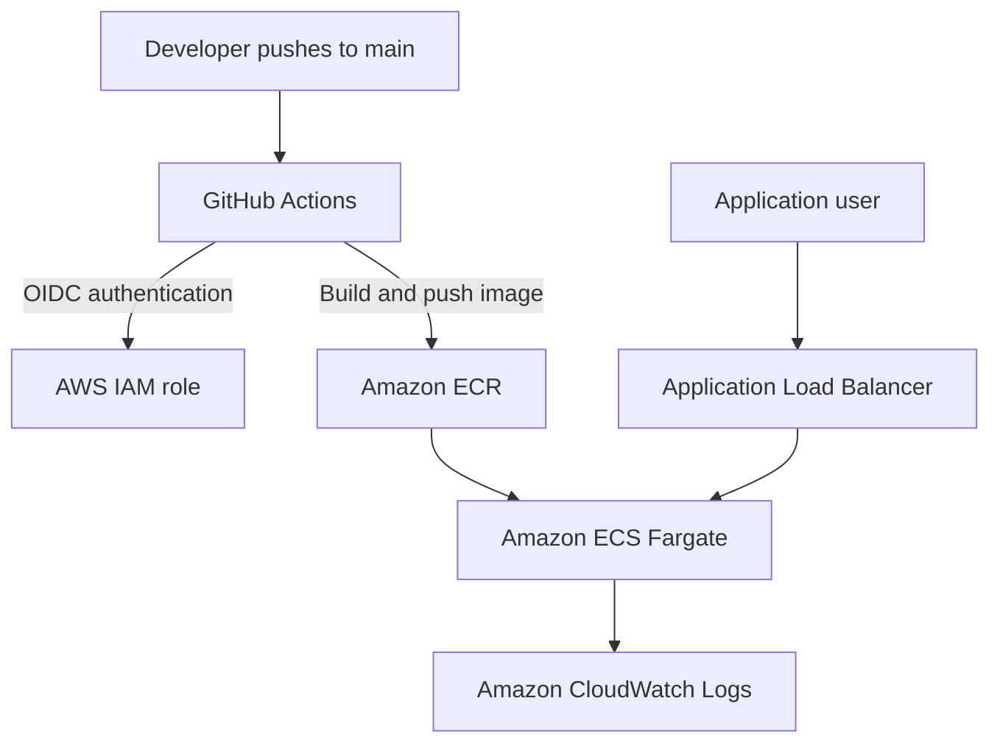
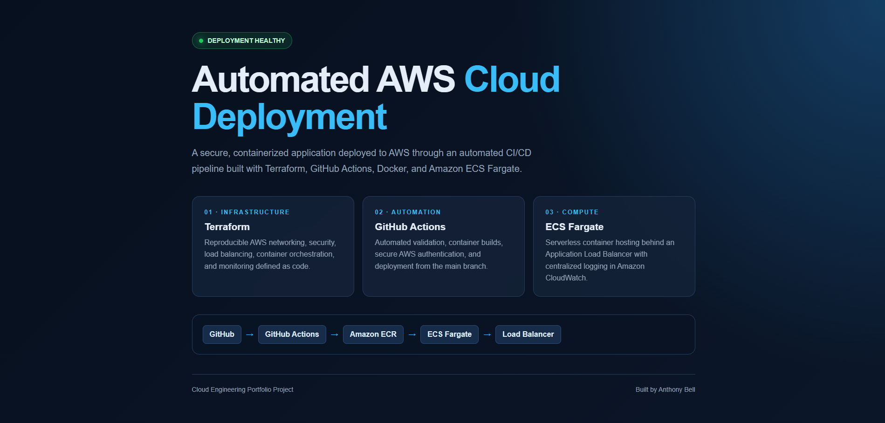
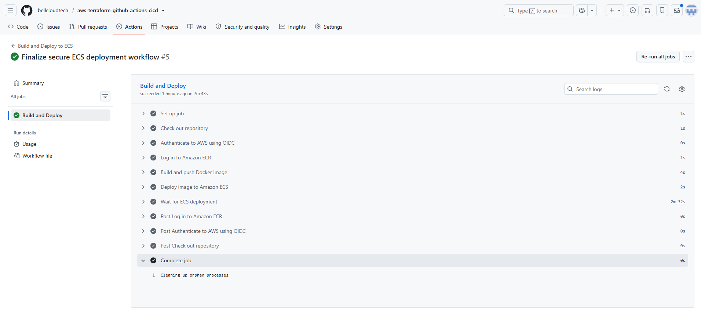
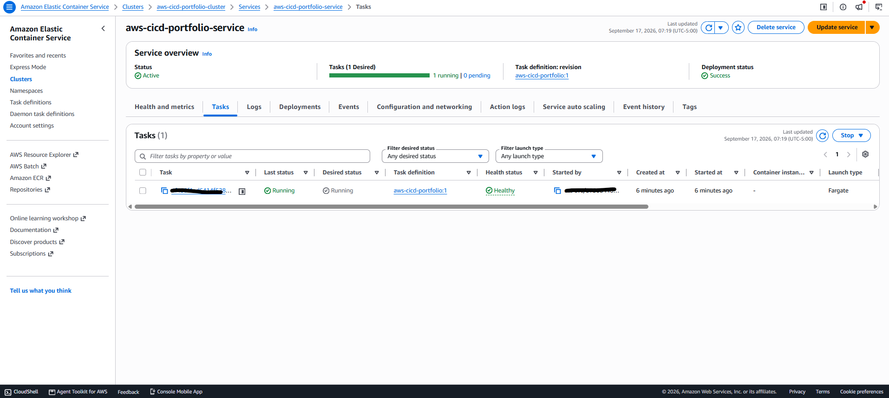
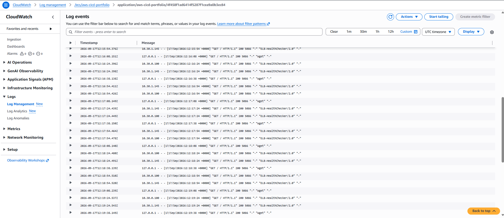

# Automated AWS ECS Deployment with Terraform and GitHub Actions

A production-style CI/CD project that automatically builds a containerized web application and deploys it to Amazon ECS Fargate.

The infrastructure is defined with Terraform, application images are stored in Amazon ECR, and GitHub Actions authenticates to AWS securely through OpenID Connect (OIDC)—without storing AWS access keys in GitHub.

## Architecture



## Technologies

- Amazon Web Services
- Terraform
- GitHub Actions
- GitHub OIDC
- Docker
- Amazon ECR
- Amazon ECS Fargate
- Application Load Balancer
- Amazon CloudWatch
- AWS IAM
- Amazon VPC
- NGINX

## What This Project Demonstrates

- Infrastructure as Code using Terraform
- Automated Docker image builds
- Secure, keyless AWS authentication with GitHub OIDC
- Automated image publishing to Amazon ECR
- Automated deployment to Amazon ECS Fargate
- Load-balanced container hosting
- Least-privilege IAM permissions
- Application health checks
- Centralized container logging
- Secure management of repository secrets

## Deployment Workflow

1. Code is pushed to the `main` branch.
2. GitHub Actions requests an OIDC identity token.
3. AWS validates the token and grants temporary credentials.
4. GitHub Actions builds the Docker image.
5. The image is tagged with the Git commit SHA.
6. The image is pushed to Amazon ECR.
7. The ECS service begins a new deployment.
8. GitHub Actions waits until the service becomes stable.

## Project Evidence

### Deployed Application



### Successful GitHub Actions Pipeline



### Healthy ECS Fargate Service



### CloudWatch Container Logs



## Repository Structure

```text
.
├── .github/
│   └── workflows/
│       └── deploy.yml
├── app/
│   └── index.html
├── docs/
│   └── images/
├── terraform/
│   ├── ecr.tf
│   ├── ecs.tf
│   ├── iam.tf
│   ├── load_balancer.tf
│   ├── logs.tf
│   ├── network.tf
│   ├── oidc.tf
│   ├── outputs.tf
│   ├── providers.tf
│   ├── security.tf
│   ├── variables.tf
│   └── versions.tf
├── .dockerignore
├── .gitignore
├── Dockerfile
└── README.md
```

## Security

- No AWS access keys are stored in GitHub.
- GitHub Actions uses short-lived AWS credentials through OIDC.
- The IAM trust policy restricts access to this repository and its `main` branch.
- The deployment role is limited to the required ECR and ECS operations.
- Sensitive local files and Terraform state are excluded through `.gitignore`.
- ECS tasks only accept application traffic from the load balancer.

## Local Docker Test

```bash
docker build -t aws-cicd-portfolio:local .
docker run --rm -p 8080:8080 aws-cicd-portfolio:local
```

Open `http://localhost:8080` in a browser.

## Terraform Commands

```bash
terraform -chdir=terraform init
terraform -chdir=terraform validate
terraform -chdir=terraform plan
terraform -chdir=terraform apply
```

Destroy the AWS resources when they are no longer needed:

```bash
terraform -chdir=terraform destroy
```

## Author

**Anthony Bell**

Cloud engineering portfolio project focused on AWS infrastructure, containerization, automation, security, and monitoring.